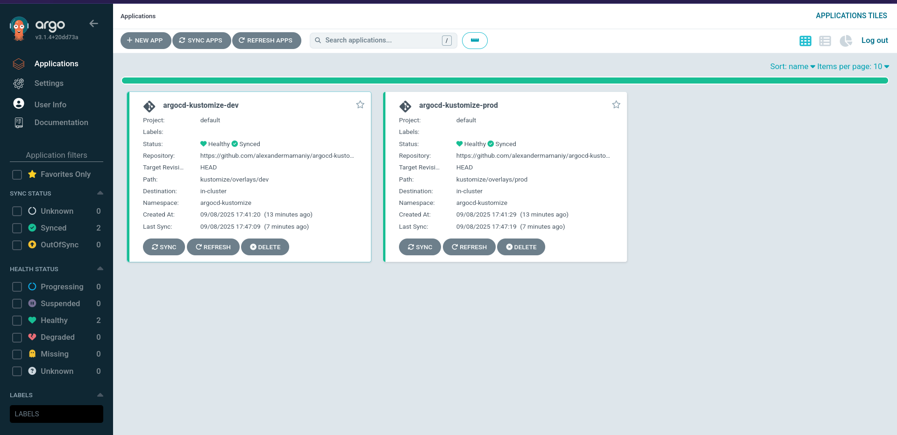
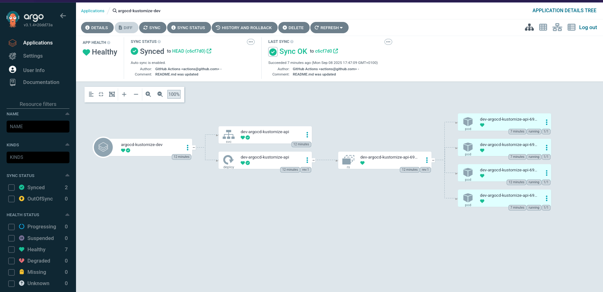
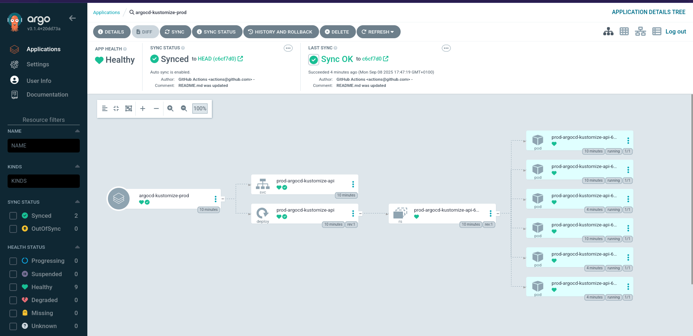

# ArgoCD - Kustomize Kubernetes Deployment

This repository shows a GitOps workflow using ArgoCD with Kustomize for automated enterprise Kubernetes deployments, by deploying the artifact to development and production cluster. It uses GitHub Container Registry for images and supports secure, automated application sync.

### Requirements:
- kubectl: Client v1.33.1, Server v1.33.1

- Kustomize: v5.6.0

[//]: # (- Helm: v3.18.6)

### Install ArgoCD: 

```bash
helm repo add argo https://argoproj.github.io/argo-helm 
helm repo update 
kubectl create namespace argocd 
helm install argocd argo/argo-cd --namespace argocd
```

Retrieve ArgoCD Admin Credentials: 
```bash
kubectl -n argocd get secret argocd-initial-admin-secret -o jsonpath="{.data.password}" | base64 -d
```

Create Namespace for Application: 
```bash
kubectl create namespace argocd-kustomize
```

Create Image Pull Secret (replace YOUR_USERNAME and YOUR_PAT): 
```bash
kubectl create secret docker-registry ghcr-secret --docker-server=ghcr.io --docker-username=YOUR_USERNAME --docker-password=YOUR_PAT --namespace=argocd-kustomize
```


Deploy the Application manifest in ArgoCD: 

```bash
kubectl get svc -n argocd 
kubectl apply -f argocd/applications/kustomize-application-dev.yaml
kubectl apply -f argocd/applications/kustomize-application-prod.yaml
```

Access ArgoCD UI: 
```bash
kubectl port-forward svc/argocd-server -n argocd 8080:80 
```

Then open http://localhost:8080 in your browser.

Verify Deployment: 
```bash
kubectl get pods -n argocd-kustomize
```

### Overview


### Development


### Production



 